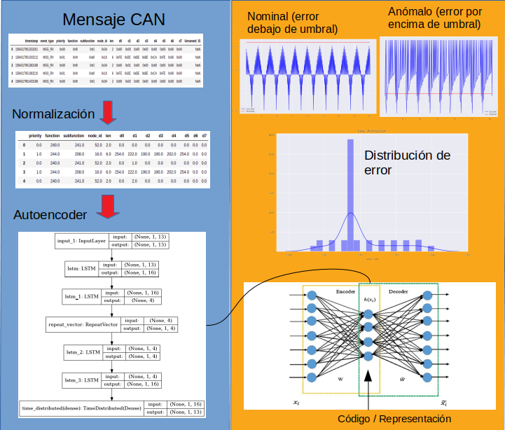

# CANBus Traffic Anomaly Detection with LSTM and Autoencoders

This is an experiment of training an LSTM Autoencoder to detect anomalous traffic in a CANBus. It is based on [1]. Further improvements in feature engineering such as adding frequency (see [2]) are considered but  not yet implemented.

## 

## Project Organization and instructions

```
./
	data									CAN Traffic CSVs (real and generated).
	doc										Doc and diagrams.
	models 									Exported models.
	notebooks			
		CAN Data Generator.ipynb 			Test data generation.
		CAN_Autoencoders_LSTM.ipynb 		Model training and testing.
	references								Some reference papers.
	README.md 								This file.
```

The code has been tested with [tensorflow1.12-py3-jupyter-opencv](nhorro/tensorflow1.12-py3-jupyter-opencv).

```bash
docker run -it --rm --runtime=nvidia -v $PWD:/tf/notebooks --name tensorflowdev1 --network=host nhorro/tensorflow1.12-py3-jupyter-opencv:1.1.0
```

Real data is not included. Howver a mock to generate simulated data of nominal and broken traffic is provided. The notebook contains the code to train the network and test it against nominal and broken traffic.

## References

- *[1] "Anomaly Detection of CAN Bus Messages Using a Deep Neural Network for Autonomous Vehicles" -  Aiguo Zhou, Zhenyu Li, and Yong Shen (2019)*
- *[2] "Automotive Intrusion Detection Based on Constant CAN Message Frequencies Across Vehicle Driving Modes" - Clinton Young, Habeeb Olufowobi, Gedare Bloom, Joseph Zambreno.*